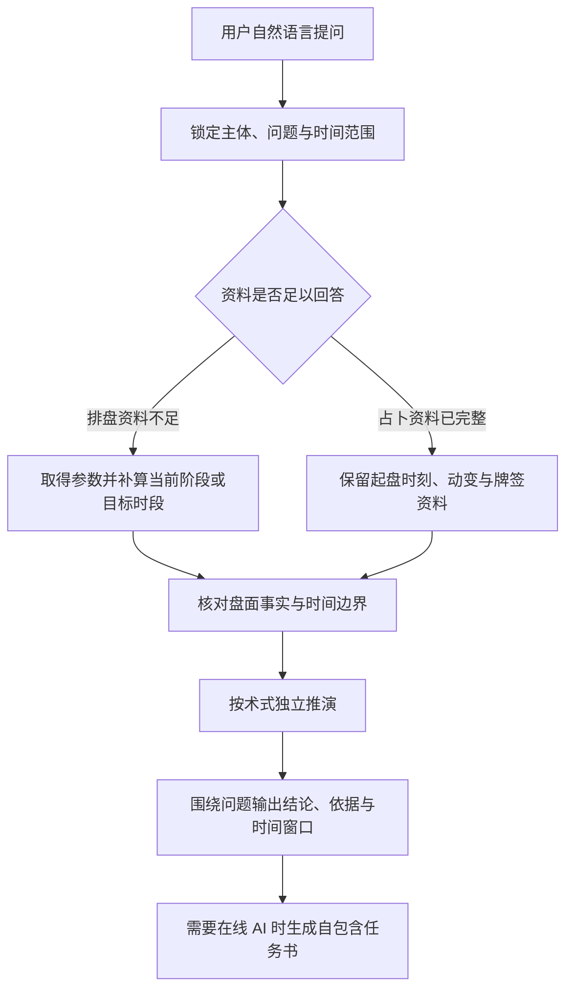

# 通用命理与周易术数专业工作流

本 Skill 定义了一套独立于具体产品和底层服务的通用算命方法论体系。其核心职责不是罗列端点，而是**把用户的现实诉求准确转化为正统术数任务，获取可信的盘面计算事实，遵循古法规则进行严谨推演，并转化为现代场景中有依据、有边界、可验证的决策指引**。

底层排盘引擎（包括 AOV 公开 API、Mingyu MCP Server、本地排盘器或人工录入盘面）均作为可替换的数据提供方（Provider）接入，不反向主导算命推演逻辑。

---

## 一、标准任务生命周期：按资料与问题自适应的任务流程（Lifecycle）

每次解读都先锁定主体和问题，再按资料完整度与时间范围选择必要步骤。排盘类优先补齐当前阶段和目标时段的可核验资料；占卜类直接把本次起卦、起课、牌阵或签谱中已有的有效信息完整展开。传统条文只在能改变取义时查询，不为凑流程而查。

1. **锁定问题与主体**：提取主问题、事项主体、目标时段和现实约束；历史对话或补算不得更换主体。详见：[`references/intake.md`](references/intake.md)。
2. **核验资料**：区分已知资料与缺失资料，**坚决不替用户补造资料**。缺时辰时只做可支持的八字分析，真太阳时、历史时区和夏令时冲突要明确记录。
3. **按需取得资料**：排盘类优先取得参数格式并补算当前阶段、所属上层运限和目标时段；只有传统条文会改变判断时才查询。占卜类优先完整保留本次起盘事实，不强行补造出生运限。
4. **核对与推演**：按术式独立核对关系、起止边界和时间窗口，区分盘面事实、传统取义、推断与现实核验。详见：[`references/evidence.md`](references/evidence.md) 与 [`references/timing.md`](references/timing.md)。
5. **组织回答**：先给主要结论，再给关键依据、条件分支、时间窗口和现实核验；需要在线 AI 深读时再生成自包含任务书。详见：[`references/output.md`](references/output.md)。

---

## 盘面核验与资料范围

解读依本次已有盘面、所选方法和用户问题展开。下列各术式流程作为有相应资料时的路线，未计算的运层、时辰或其他方法不因流程列出而自动补齐。遇到方法选择、资料缺口或跨体系请求时，先按 [方法路由](references/routing.md) 确认需要的资料与时限范围；进入传统判断时结合 [传统理法](references/interpretation.md)，遇到跨盘、跨时点、生克方向或起数口径问题时，再按需读取 [盘面事实与推理核验](references/reasoning-checks.md) 中对应术数一行，并复核影响结论的关键事实。该参考用于工作流程，在线 AI 的原生任务书保留自身完整正文。

## 二、首轮判断规则（First-Turn Rules）

| 用户首轮输入场景                          | 规范动作                                                                                   | 严禁行为（红线）                                   |
| :---------------------------------------- | :----------------------------------------------------------------------------------------- | :------------------------------------------------- |
| **模糊提问（如“帮我算算事业”）**          | 先澄清核心诉求类型（长期方向还是眼前某事）、时间范围，询问是否有出生时辰。                 | 严禁直接默认排八字紫微，严禁直接盲目起局。         |
| **明确指定术数（如“用六爻看面试”）**      | 严格尊重指定方法，确认起卦时间或收集卦象，收窄为具体一事一问。                             | 严禁强行索要出生八字替代这次占问。                 |
| **复杂复合诉求（如“未来两年换城创业”）**  | 拆解分层：命理看个人长期承载力，周期方法看这两年大运节点，奇门/六爻看当前具体方案与方位。  | 严禁把不同术数结果算个“吉凶平均分”或搞多数投票。   |
| **出生时辰未知（仅有年月日）**            | 明确告知八字可排前三柱看大势五行，但紫微与奇门终身局因依赖时辰必须暂缓，询问是否愿意补充。 | 严禁自行猜测一个时辰强行排紫微或终身局。           |
| **用户已提供现成盘面资料**                | 先核验盘面时间、地点经纬度和算法流派口径，直接进入事实规范与解读。                         | 严禁静默重新排盘覆盖用户提供的原始盘面。           |
| **数据服务故障或网络超时**                | 保留用户问题卡与已确认资料，无缝降级为基于已知资料的人工推演或提供补录路径。               | 严禁将 HTTP 报错、超时或空数组解释为“命理大凶”。   |
| **涉及高风险领域（健康/法律/投资/自伤）** | 明确玄学仅作个人心态与传统象意参考，第一时间坚决建议寻求医院医疗、执业律师或专业机构帮助。 | 严禁给出具体疾病诊断、保本投资承诺或逃避法律建议。 |

### 2.1 全门类术数信息采集要素（各门类最小必要参数）

若用户输入资料不完整，依所选术数门类直接确认缺失项（客观直接，无需客套虚饰）：

1. **先天命理类（八字 / 紫微斗数 / 星盘 / 七政四余 / 奇门终身局）**：
   - 历法类型：公历（阳历）或农历（阴历），闰月需确认；
   - 出生时间：具体年月日与出生时分（若时辰不详，八字仅排前三柱，紫微/终身局暂停起盘）；
   - 出生地点：省份与城市区县（用于计算真太阳时经度时差与历史夏令时换算）；
   - 性别：男（乾造）或女（坤造），决定大运顺逆与起运交运岁数排布；
   - 关注诉求：所问具体方向（事业、财运、婚恋、健康或宏观格局）。
2. **事态占问类（六爻 / 奇门时家 / 大六壬 / 金口诀 / 梅花易数 / 小六壬）**：
   - 明确唯一事项：一事一占，禁止多事杂问；
   - 占问时间：当下精确时刻（公历年月日时分）；
   - 术数特有起卦参数（可选）：六爻铜钱摇卦记录、梅花数字/声音数/单字左右分笔/2—3字逐字笔画/4—10字传统平上去入声数/方位物象、金口诀指定地分、大六壬月将；
   - _红线：占卜具体事项严禁强索生辰八字替代当刻卦象！_
3. **双方合盘类（八字合婚 / 紫微合盘 / 西占双盘）**：
   - 双方完整出生资料（年月日时分、出生地点、性别）；
   - 双方现实关系状态（已婚、恋人、商务合伙考察等）。
4. **时空择吉与环境风水（黄历择日 / 住宅风水合参）**：
   - 黄历择日：具体事项类别（嫁娶、移徙、开市、动土等）、候选起止日期范围（建议15~30天）、主事参与人生年生肖；
   - 住宅风水：房屋坐山朝向度数（罗盘实测度数）、建造或入住运年（确定三元九运）、居住人生年生肖；需要阶段判断时补充目标流年和流月日期。
5. **姓名数理与传统签谱（汉字姓名分析 / 三山国王灵签）**：
   - 姓名数理：姓氏与名字汉字原文，若需考查补益则附出生生辰；
   - 灵签求签：心中默想所求之事，获取签号与签诗原文。

### 2.2 全门类术数结构化输出规范（按术式自洽排版）

向用户呈现推演结果时，遵循各门术数自身的传统自洽语法与清晰排版：

- **八字命理**：四柱干支与藏干十神列表 → 日主强弱（得令、得地、得势）与正统格局定性 → 气候调候与用神喜忌 → 当前大运与近期流年岁运生克。
- **紫微斗数**：命身宫位置与局数 → 命宫及三方四正星曜组合（庙旺利陷） → 生年四化落宫 → 当前大限与流年太岁引动变化。
- **八字紫微合参**：八字确立五行旺衰与命运大纲 → 紫微十二宫映射现实人事场域 → 提取两盘相互印证的核心共识，剖析口径分歧。
- **六爻占卜**：本卦与变卦卦象 → 世爻、应爻与用神确立 → 月建、日辰生克与旬空月破 → 动爻变爻与六亲六神联动 → 明确定性结果与年月日时应期。
- **时家奇门**：局象基本信息（阴阳遁、局数、旬首值符值使） → 九宫四盘分布（九星、八门、八神、奇仪） → 主客动静分析与时空方位吉凶建议。
- **大六壬**：天地盘与月将加时 → 四课确立（主客彼我生克） → 三传发用推进（初传发端、中传移易、末传归结） → 课体定性与十二天将神煞断语。
- **梅花易数**：成卦象数结构 → 体用五行生克定大势吉凶 → 互卦剖析事态中间波折过程 → 变卦指示事情最终归结。
- **黄历择吉**：候选日期优选评分列表 → 建除十二神与丛辰吉凶明细 → 主事人属相冲煞避忌提示 → 已计算时辰的适用条件。
- **住宅风水**：八宅生年命卦与宅卦相配 → 玄空九运三盘飞星分布（运盘、山盘、向盘） → 目标流年、节气流月飞星叠加 → 旺山旺向/双星会向格局定性 → 关键气口与功能区生克布局建议。
- **姓名数理**：汉字康熙笔画与五行属性 → 天格、人格、地格、总格、外格五格剖析 → 三才配置生克吉凶 → 八十一数理暗示。

---

## 三、术数选择全景引导矩阵（Routing Matrix）

根据问题的核心属性，全面引导选用最匹配的术数：

| 任务目标与决策场景                             | 首选正统术数                  | 补充/合参术数        | 核心取用依据与输出重点                                                                               |
| :--------------------------------------------- | :---------------------------- | :------------------- | :--------------------------------------------------------------------------------------------------- |
| **终身命运、性格潜能、大运十年起伏**           | **八字 + 紫微斗数合参**       | 奇门终身局、西洋星盘 | 八字以月令提纲定命运主线与五行喜忌，紫微以十二宫与四化飞星验生活场域。                               |
| **未来一年至数年大势、事业财运走势**           | **八字岁运 + 紫微运限**       | 西占行运、七政流曜   | 八字看太岁干支对命局的生克冲合，紫微看流年太岁命宫四化叠照。                                         |
| **具体某一事项能否推进、短期成败、应期**       | **六爻预测学**                | 大六壬、金口诀       | 一事一占之王。严格确立用神，以月建日辰定旺衰，以动爻刑冲克害推演事态演变与年月日应期。无需出生时辰！ |
| **项目推进策略、方位选择、谈判主客、时空窗口** | **时家奇门遁甲**              | 六爻、梅花易数       | 奇门精于空间方位与主客动静（动者为客、静者为主），查九星、九宫、八门、八神。                         |
| **复杂多方博弈、消息真伪、人事网络**           | **大六壬**                    | 六爻、金口诀         | 人事推演之巅。四课定主客彼我，三传揭示事情发端、移易与归结全生命周期。                               |
| **见机而作、数字或物象触发、象数演变**         | **梅花易数**                  | 小六壬               | 心易灵感。以体用生克定大势，以互卦看中间过程波折，以变卦看最终结局。                                 |
| **日常琐碎小事快速决断（30秒速断）**           | **小六壬**                    | 梅花易数             | 农历月日时顺数推移，以**时宫**为最终决疑主证，绝不用于宏观命运。                                     |
| **双方长期婚恋匹配、深度合伙合作**             | **八字双盘 + 紫微合盘**       | 西占双盘（Synastry） | 八字看双方日主五行喜忌互补与四柱合冲，紫微看关键宫位叠盘与生年四化跨盘落宫。                         |
| **重大事项挑日子（结婚/搬家/开业/签约等）**    | **黄历择日**                  | 八字参与人避冲       | 在候选日期范围内，依建除十二神、丛辰神煞并结合主事人四柱剔除岁破、月破及日辰刑冲。                   |
| **住宅办公选址、空间环境布局调谐**             | **住宅风水合参（八宅+玄空）** | 采光动线与安全排查   | 八宅法以居者生年命卦配宅山向，玄空法以三元九运及精准度数排布山向运三盘飞星。                         |
| **个人潜意识投射、多视角心理叙事启发**         | **塔罗牌 / 雷诺曼**           | 叙事式提问           | 象征探索工具。反映心态倾向与盲点，不作为客观必然判定。                                               |
| **古典神示与德性修养启迪**                     | **三山国王灵签**              | -                    | 纯正民间传统签谱，依签号、签题、签诗与历史典故提供修身启示。                                         |
| **宏观年度气候节律、历史时代周期**             | **五运六气 / 皇极经世**       | 太乙神数             | 五运六气推演年度五步主客运与司天在泉；皇极经世以元会运世推演时代大势与值年卦。                       |

---

## 四、多术数与多流派合参要领（Synthesis）

1. **统一主问题**：所有参与合参的方法必须对准同一件事与同一时间范围；
2. **独立推导**：各术式严格遵循自身推理语法（八字不借紫微星曜，奇门不借六爻爻辞）；
3. **层级对齐**：长期命理回答“能否承载与长远方向”，短期占问回答“当前具体机缘与成败”，奇门回答“动静时空策略”；
4. **共识与分歧并存**：明确提取多方支持的核心结论，坦诚剖析分歧缘由，**绝不搞少数服从多数的机械投票**。
   详见参考文档：[`references/synthesis.md`](references/synthesis.md)。

---

## 五、数据提供方适配与调用指引（Provider Integration）

本方法论不硬编码任何专属底层引擎，数据通过标准 Provider 协议接入（详见 [`references/providers.md`](references/providers.md)）。

当前官方推荐的数据提供方为 **AOV 公开 API 与 Mingyu MCP Server**：

- **AOV/Mingyu 适配参考手册**：[`references/providers/aov-mingyu.md`](references/providers/aov-mingyu.md)。
- **包含内容**：
  - 50+ 个 REST API 端点全量清单与 MCP 工具名映射，含焦氏易林固定索引查询；
  - 18 种塔罗牌阵、8 种雷诺曼牌阵与金口诀指定地分参数契约；
  - 五运六气 26 年符会校勘口径与皇极经世 1984 年鼎卦值年锚点；
  - 统一流派参数 `schools` 规范（八字子平/盲派/新派、紫微三合/飞星/四化、六爻火珠林/卜筮正宗/增删卜易等）；
  - `responseMode: "prompt-only"` 与 `detailMode: "compact"` 高效轻量调用实践；
  - 网络异常与服务降级处理规范。

命理排盘调用的范围默认取当前阶段：八字优先取得运，紫微优先取当前大限；需要回答今年、近期或具体日期时，必须继续保留所属大运/大限和上层边界，再按年、月、日、时逐层细化。需要比较完整人生时间线时才使用全部范围。占卜类没有出生运限，则完整保留起卦时刻、历法、时区、动变和牌阵等实际时间资料。

---

## 六、安全、伦理与专业红线（Safety & Ethics）

1. **医疗健康**：传统术数仅解析五行气机与情志偏颇，**严禁替代临床医疗诊断**！遇到急性胸痛、剧痛或自伤倾向，必须坚决引导第一时间就医。
2. **法律纠纷**：卦象仅反映博弈态势，**严禁替代执业律师法律意见**。
3. **高额投资**：仅解析商业敏锐度与财务周期，**严禁承诺保本收益或指定买卖单只标的**。
4. **重大抉择（离婚/离职）**：提供双轨条件分支（If-Then）分析各自代价与收益，绝不替用户下达强制命令。
5. **隐私去标识化**：生成提示词时对真实姓名进行中性代称替换。
   详见参考文档：[`references/safety.md`](references/safety.md)。

## 内置解读流程

[解读流程资料](references/reading-workflow.json) 提供可直接加载的共同原则和分术式解读路线，与资料采集、事实核验、时间分层和合参流程配合使用。内置 AI 按当前盘面选取对应路线，按需查询传统条文或补充已有出生资料对应的目标时段，随后完成解读。原始盘面始终保留，准备过程与复制用任务书分别组织。
